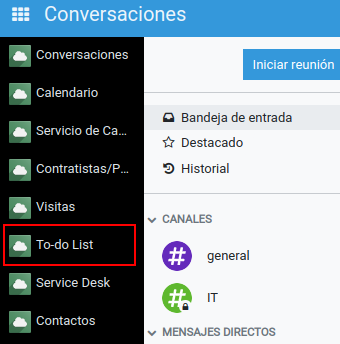
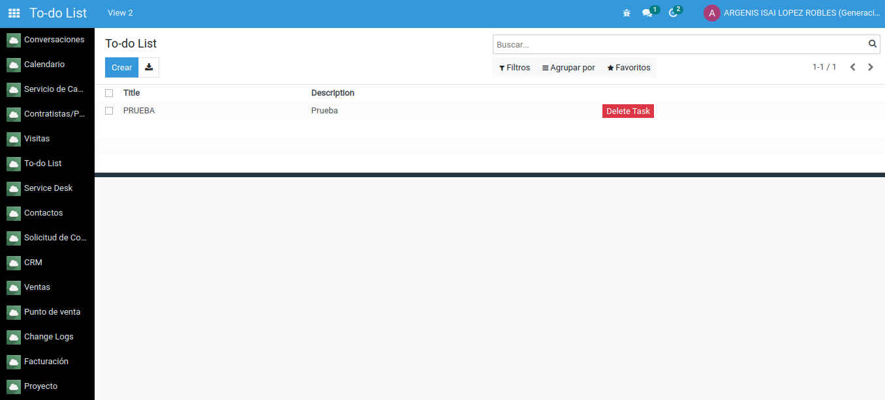
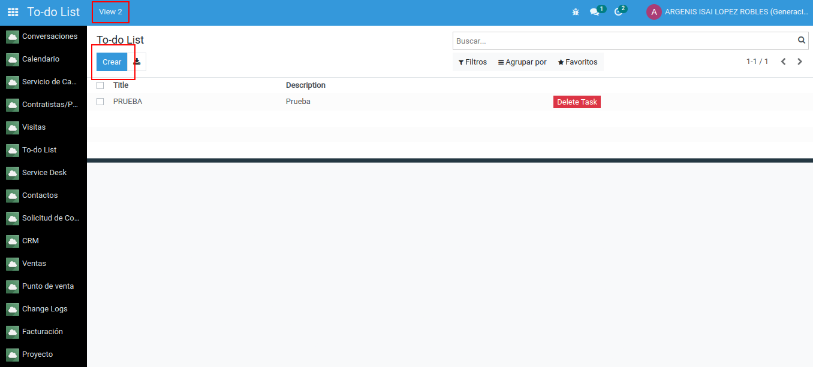
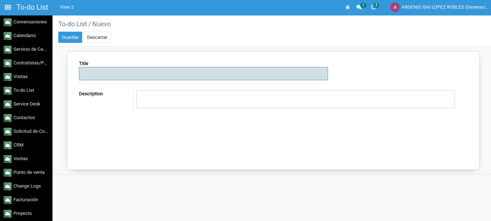
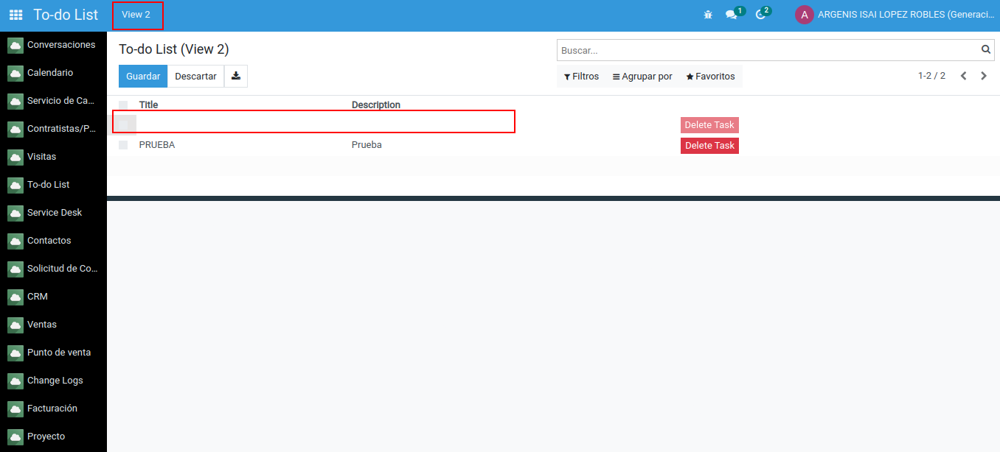
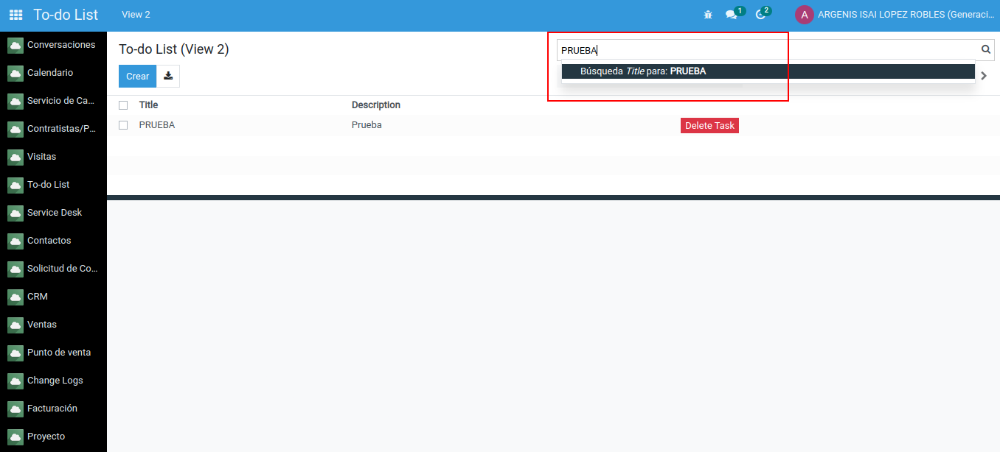
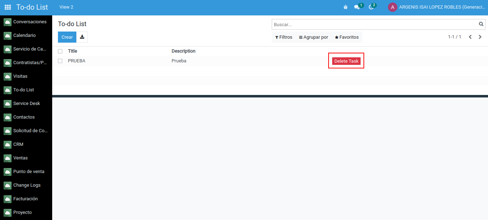
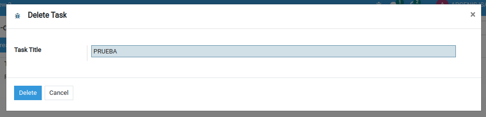

# odoo-test-tecnico-sb
 Modulo creado como parte del Technical Test for Odoo Developer

## Instrucciones de instalación
Este módulo fue desarrollado con Odoo en su versión 15, y para instalarlo se deben seguir los siguientes pasos:

1. Descargar este módulo, descomprimirlo y moverlo a la ruta /opt/odoo15/odoo-custom-addons/
2. Dentro de Odoo, ir al módulo llamado 'Aplicaciones'
3. Dar click en el botón llamado 'Actualizar lista de aplicaciones'
4. Una vez actualizada la lista, ir al buscador y escribir 'odoo_technical_test_sb'
5. Ya que aparezca el módulo, dar click en el botón de 'Instalar'

## Instrucciones de uso
Para que el módulo pueda ser visible dentro de Odoo es necesario ir a 'Ajustes' -> 'Usuarios' -> Tu usuario -> 'To-do List' -> Escoger entre 'User' (permisos para leer, modificar y crear) y 'Administrator' (permisos para leer, modificar, crear y eliminar)

Una vez que se hayan otorgado permisos al usuario se visualizará el módulo llamado 'To-do List' en el menú principal de Odoo:

Al entrar, aparecerá una vista lista donde se desplagarán todos los 'Tasks':

Para crear una Task debes dar click en el botón llamado 'Crear' tanto en la vista original como en la vista desplegada al dar click en el botón llamado 'View 2':

Hay dos formas en las que se visualizará la creación de la Task:

1. Desde la vista original, se desplegará una vista de tipo formulario donde aparecerán los campos para introducir 'Title' y 'Description' respectivamente:

2. Desde la segunda vista, se desplegará una nueva línea en la lista de registros y ahí se podrá registrar 'Title' y 'Description' en su espacio respectivo:

Conforme se vayan creando registros se irán mostrando en la vista lista del módulo.
Para realizar la búsqueda de algún registro por su nombre, es necesario dar click en la barra de búsqueda, escribir el nombre y dar click en el apartado que se despliega:

Para eliminar una 'Task' (necesario el permiso de 'Administrator') se debe hacer lo siguiente:
1. Dar click en el botón de color rojo, llamado 'Delete Task', que aparece en cada registro:

2. Se desplegará una vista de tipo wizard con el campo de 'Title' para que pueda ser llenado, automáticamente se toma el dato del registro para facilitar la operación:

3. Dar click en el botón llamado 'Delete' para borrar el registro:
